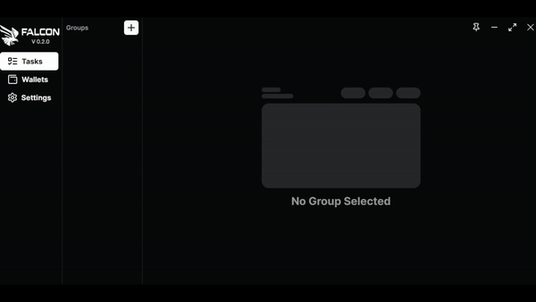

# Mint

With your wallets appropriately configured and adequately funded in ETH, and your node successfully integrated into Falcon, you can now dive into configuring tasks and minting.

To start, create a group to keep your minting tasks organised, give it a name and enter the contract adress for the nft you're looking to mint.&#x20;

<figure><figcaption>
Creation of a task group
</figcaption></figure>

Once your group is created you can start creating minting tasks. \
Click on the + button to create tasks.\
Choose the wallets for minting, pick the contract function, set the maximum and priority fees per transaction, select your node, and save the task.

<figure><figcaption>
Example of a task for a free mint
</figcaption></figure>

The "Hex" option, allows you to copy and paste a transaction created using a browser wallet like MetaMask. It will replicate the same options you would input when interacting with a contract, such as the amount of ETH, the number of NFTs to mint, and the transaction fees and priority fees.\

Now that you're able to create a basic task, we will go deeper into all the option you have at your disposal in Falcon to personnalise your minting experience.\
\
\

&#x20;

The "Trigger Strategy" feature, located adjacent to the task creation button, opens a window presenting three options: Flipstate, Timestamp, and Advance. I'll detail how to utilize each of these options below.

* Flipstate : The "Flipstate" option allows you to create a task that monitors the contract. When the contract owner initiates a transaction to enable minting, your transaction will be sent using the same fees. However, Falcon provides the flexibility to send your transaction once the transaction enabling minting is confirmed. \
  .png>)\
  You can select either option with a simple click, choosing the one that best suits your needs.&#x20;

* Timestamp : This feature enables you to schedule transactions for precise predefined times using Unix time. You can convert any time using websites such as time.is, which includes a Unix time converter in its Unix section: [https://time.is/Unix\_time\_converter](https://time.is/Unix\_time\_converter) \
  .png>) \
  To ensure that you have correctly configured the trigger and tasks, you can verify that once activated, the timer counts down like a countdown.\

<figure><figcaption>
An example using the tasks created earlier in this guide and the Timestamp feature
</figcaption></figure>

* Advance : More features are coming soon.

\
\
\
As we come to the conclusion of the "Minting" section,  you're now equipped to embark on your NFT minting journey with confidence. Falcon's intuitive design and powerful features are here to support you every step of the way, whether you're an experienced NFT trader or just starting out.&#x20;
