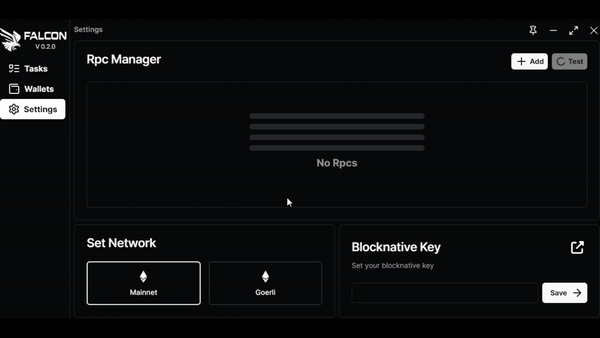

# Settings And RPC Manager

In this section, we will guide you through the process of incorporating a custom public or private node.\

<figure><figcaption>
Adding your node to Falcon
</figcaption></figure>

To incorporate a private or public node, navigate to the settings tab, click on "Add," input the desired name for your node, provide the corresponding link, and click "Save". \
You can then test it using this button  to see your ping.
